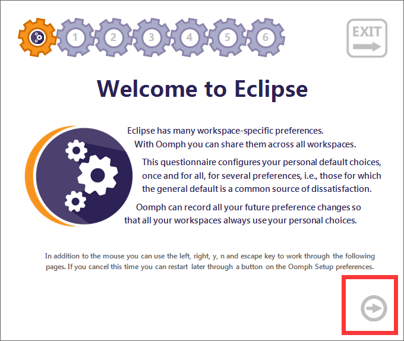
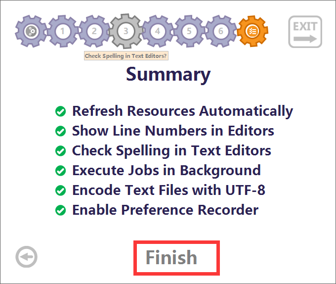
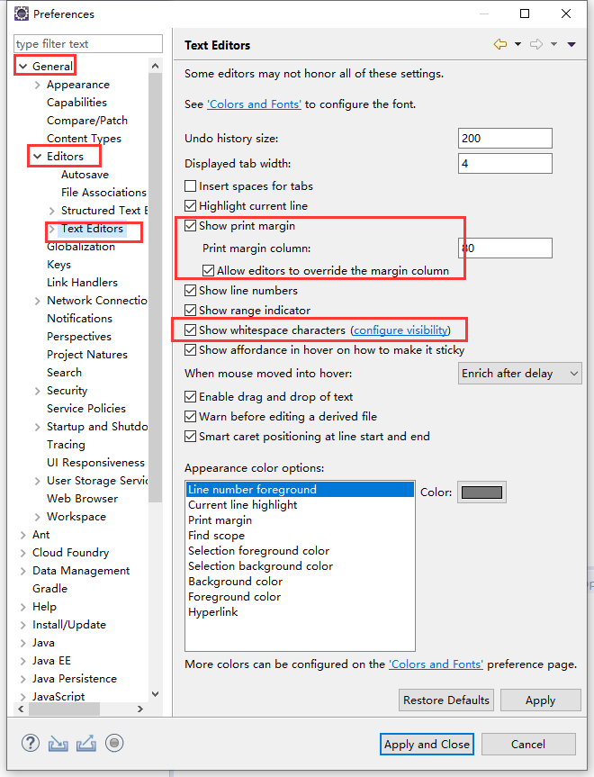
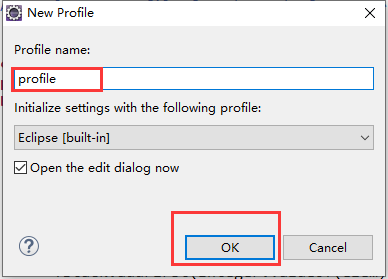
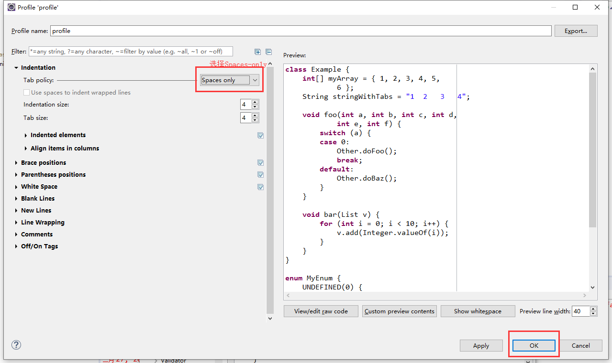
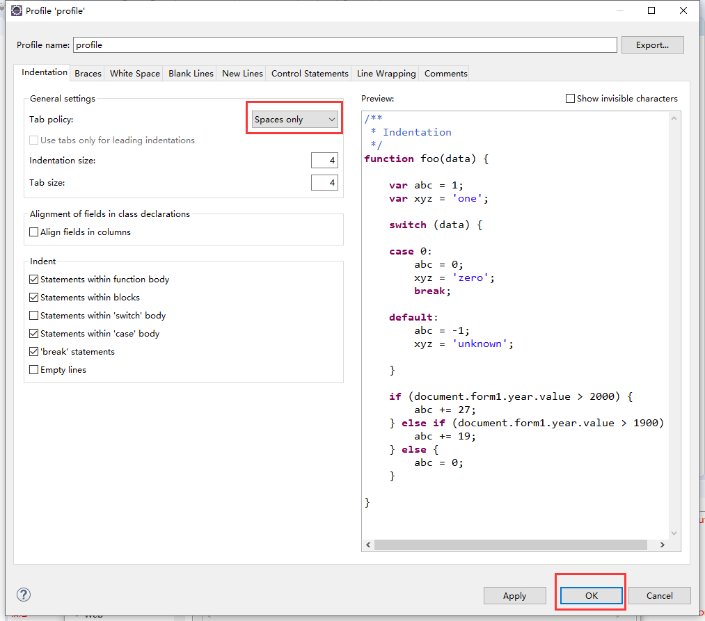

# Eclipse 配置说明

## 一、启动界面

**选择第一个**

**进入 选勾 直到没为止 Finish **

## 二、更改字体
**Window -> Preferences -> General -> Colors and Fonts  -> Basic -> Text Font**

## 三、更改Text Editors

**Window -> Preferences -> General -> Editors -> Text Editors**

**除第一个选项外全部勾起**

显示打印边距

显示空白字符

**点击configure visibility**

## 四、更改Java

**Window -> Preferences -> Java ->Code Style ->Formatter**

**创建profile**

**更改Tab policy 选择 Spaces only，只允许空格**

## 五、更改JavaScript

**Window -> Preferences -> JavaScript ->Code Style ->Formatter**

**创建profile**

**更改Tab policy 选择 Spaces only，只允许空格**

## 六、更改Web

**Window -> Preferences -> Web -> CSS Files -> Editor**

每行限制代码120

缩进使用空格

缩进尺寸4

**Window -> Preferences -> Web -> HTML Files -> Editor**

每行限制代码120

缩进使用空格

缩进尺寸4

## 七、更改XML

**Window -> Preferences -> XML -> XML Files -> Editor**

每行限制代码120

缩进使用空格

缩进尺寸4

