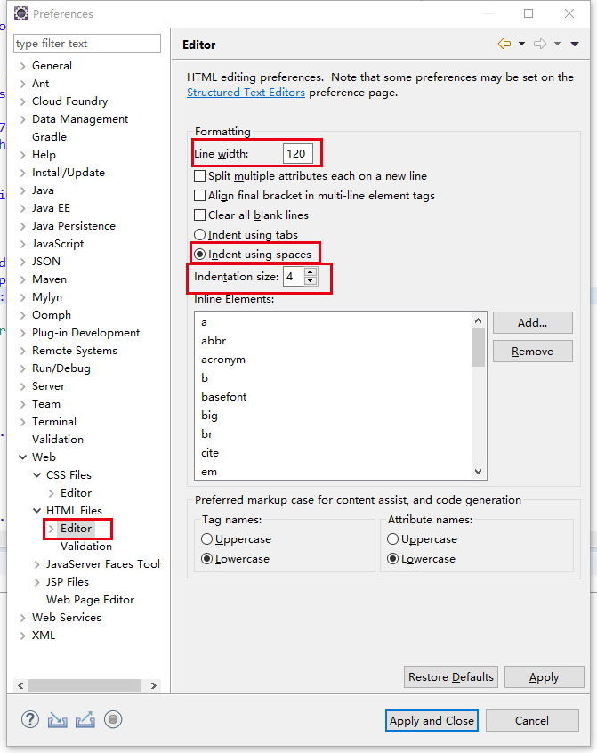

# Eclipse 配置说明
## 一、启动界面
**选择第一个**

**进入 选勾 直到没为止 Finish **

## 二、更改字体
**Window -> Preferences -> General -> Colors and Fonts  -> Basic -> Text Font**

## 三、更改Text Editors
**Window -> Preferences -> General -> Editors -> Text Editors**
**除第一个选项外全部勾起**
显示打印边距
显示空白字符

**点击configure visibility**

四、更改Java
**Window -> Preferences -> Java ->Code Style ->Formatter**

**创建profile**

**更改Tab policy 选择 Spaces only，只允许空格**

## 五、更改JavaScript
**Window -> Preferences -> JavaScript ->Code Style ->Formatter**

**创建profile**

**更改Tab policy 选择 Spaces only，只允许空格**

## 六、更改Web
**Window -> Preferences -> Web -> CSS Files -> Editor**
每行限制代码120
缩进使用空格
缩进尺寸4

**Window -> Preferences -> Web -> HTML Files -> Editor**
每行限制代码120
缩进使用空格
缩进尺寸4

## 七、更改XML
**Window -> Preferences -> XML -> XML Files -> Editor**
每行限制代码120
缩进使用空格
缩进尺寸4

