# 支付宝开发者账号申请说明

## 一、前期准备

1. 商家支付宝 -- 已完成企业认证的支付宝
2. 手机号码
3. 邮箱账号（建议为支付宝账号）
4. 公司名称
5. 经营范围 – 可根据公司名称去 [天眼查](https://www.tianyancha.com/) 或者 [企查查](https://www.qichacha.com/) 获取

## 二、申请步骤

1. 打开网址 https://open.alipay.com/ 登录支付宝账号

2. 选择自研开发者

3. 根据页面填写资料

4. 选择 `网页&移动应用`

 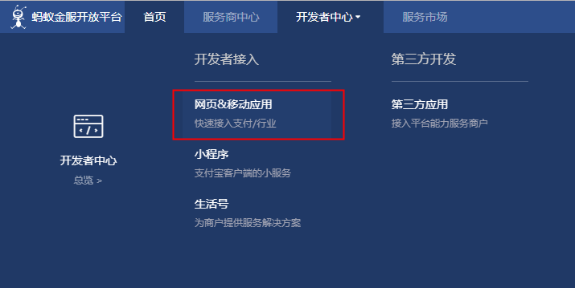

5. 创建应用

 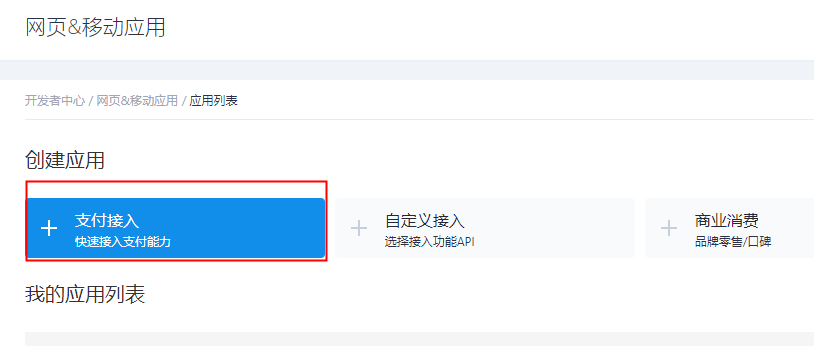

6. 填写应用名称

 

7. 上传应用 Logo

 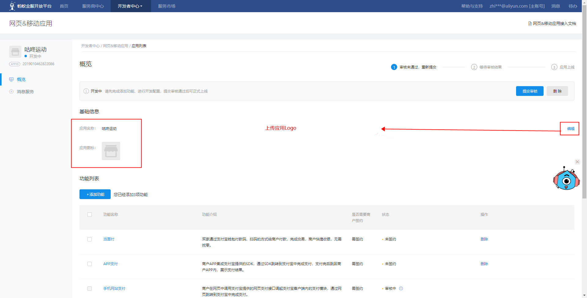

8. 设置应用公钥

 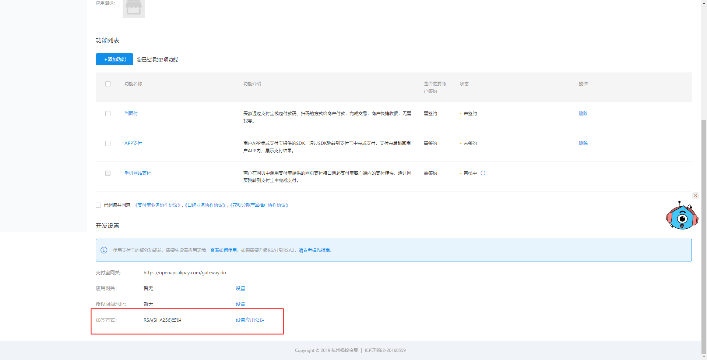

 > 设置公钥会要求填写手机验证码，根据提示完成填写即可

9. [下载](https://docs.open.alipay.com/291/106097/)RSA密钥工具

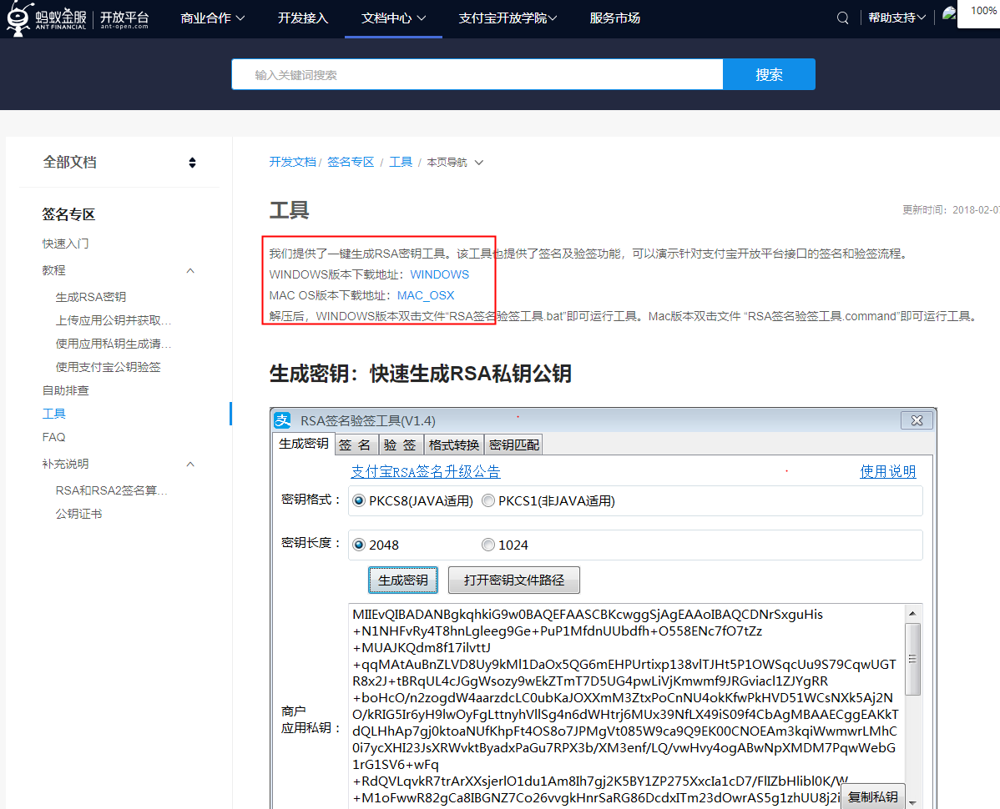

10. 解压刚刚下载的RSA签名验签工具

    

11. 打开文件内的 `RSA签名验签工具.bat`

    

12、生成密钥

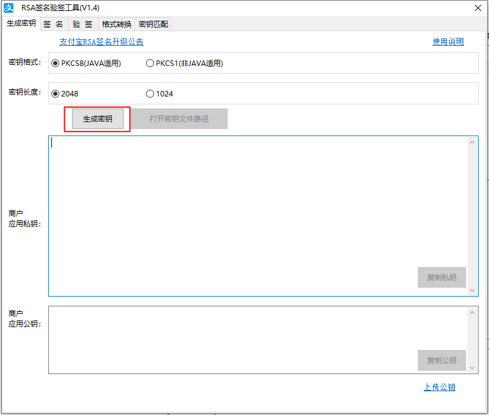

13. 备份好生成的私钥和公钥

    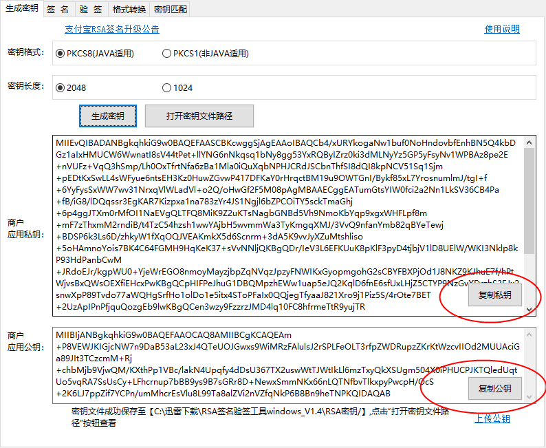

> 商户应用公钥上传到支付宝开发者平台
>
> 商户应用私钥用于存放在应用服务器

14. 上传应用公钥

    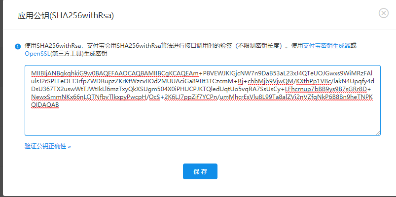

15. 获取并保存支付宝公钥

    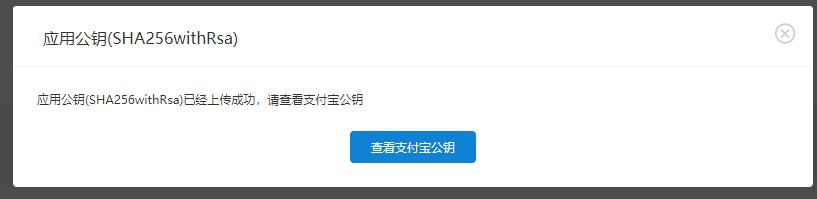

    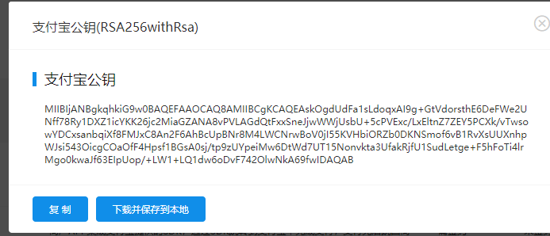

16. 提交应用审核

    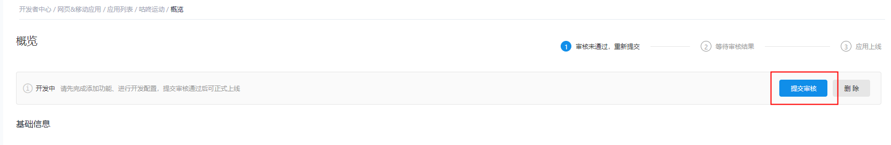

17. 提交支付签约

    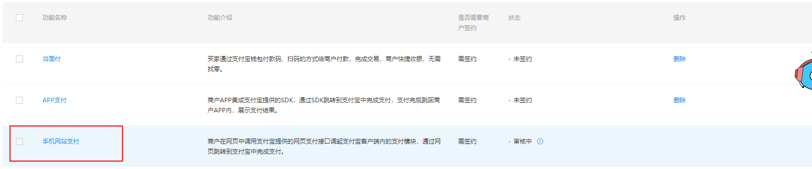

## 三、注意事项

1. 必须尽量确保支付宝的法人和公司没有财务纠纷和历史欠债问题，否则很大几率申请失败，浪费时间
2. 必须先完成 `应用App申请`
3. 应用申请完成以后才可以申请 `手机网站支付`
4. 支付功能完成以后，才可以申请提现 `单笔转账到支付宝账户`

以上三个功能申请下来，至少需要2天时间，为了不延误项目进度，最好提前申请，以上！

## 四、配置参考

文件名称 `summer-application.properties`

```
# ALiPay XXX科技有限公司
# 应用域名 https://m.tmrddq.cn
app.rootSite=
# 应用域名
alipay.site=
# 应用Id
alipay.appId=
# 商户Id
alipay.sellerId=
# 应用私钥
alipay.privateKey=
# 支付宝公钥
alipay.alipayPublicKey=
```

1. 获取应用id

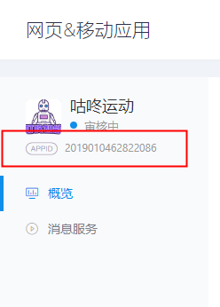

2. 获取商户Id

   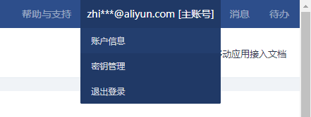

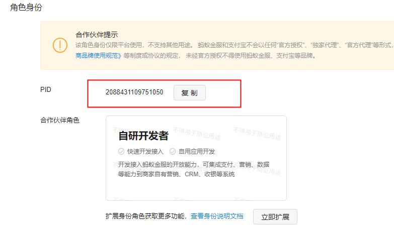