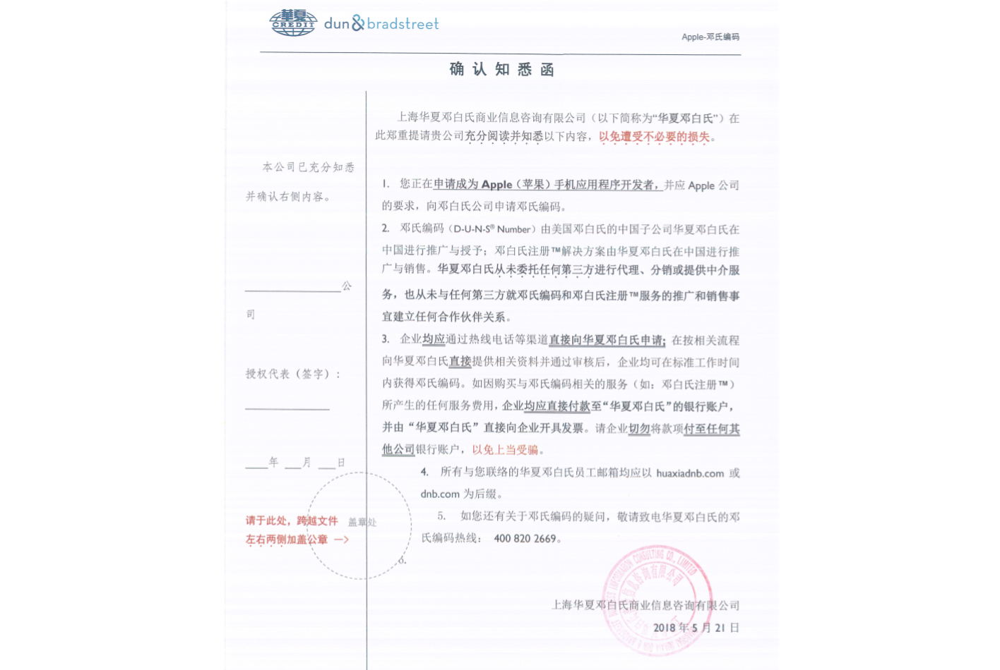

# 申请开发者账号——以组织身份注册
## 1.账号注册
### 开启双重认证：
#### 系统在ios10.3以上
​      设置——您的姓名——密码与安全性——开启双重认证——继续
#### 系统在ios10.2或更低版本
​      设置——iCloud——Apple ID——密码与安全性——开启双重认证
### 2.D-U-N-S® 编号
####   需要提供的资料如下
1. 公司清晰的营业执照正本（或副本）照片和公司公章刻字面的照片
   说明：拍完照的营业执照，可自行先扫描左下方二维码，如果可以扫到工商的信息以附件形式提供。事业单位请提供事业单位法人证。
2. 公司中文名称（工商注册的中文名，如有更名情况，请同时提供更名前和更名后的名称）
   英文名（如无正式的英文名按字面翻译）
3. 中文办公地址
   英文办公地址
4. 邮编
5. 企业类型
6. 是否是独立企业（公司有无分公司或办事处，只需填有或无）
7. 公司英文简称或英文商标（如果没有可以填无）
8. 主营业务（一个最主要的业务）
9. 员工人数（请尽量精确,例:10人；不要填区间,例：10-20人）
10. 苹果联系人（务必填写申请公司的苹果项目联系人）
    姓名
    性别
    职务
    电话（公司座机和联系人手机，所提供座机和办公地址保持一致）

#### 邓白氏编码收到后7天生效
### 3.法人实体状态
   您所在的组织必须为法人实体，才能和 Apple 签订合同。不接受 DBA、虚构公司、商号或子公司。

### 4.法律约束授权
作为组织的 Apple Developer Program 注册人，您必须拥有约束组织遵守法律协议的法律授权。您必须是组织               的所有人/创始人、行政管理团队成员、高级项目主管或拥有高级员工授予的法律授权。

### 5.网站
####    需要的资料如下
1. 公开的网站
2. 已备案域名（至少需要7天） 

###  6.附件参考
1. Apple DUNs_确认知悉函

